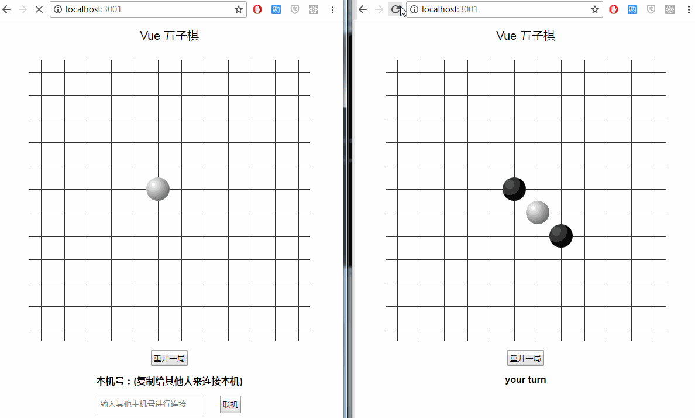

# vue-chess

> 用vue和nodejs写的网上五子棋， 单机版demo[在此](https://therefor.github.io/vue-chess/index.html)  
> 联机版demo如下：
 
> [原版](https://github.com/ccforward/cc/tree/master/chess)  有少量bug和不合理之处，对其进行了修正。 

## 使用方法

``` bash
git clone git@github.com:therefor/vue-chess.git 
cd vue-chess 
npm install 
node socket.js
``` 
 
 > 然后访问 [localhost地址](http://localhost:3001/)
